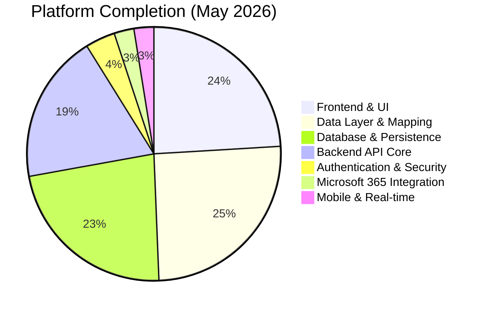
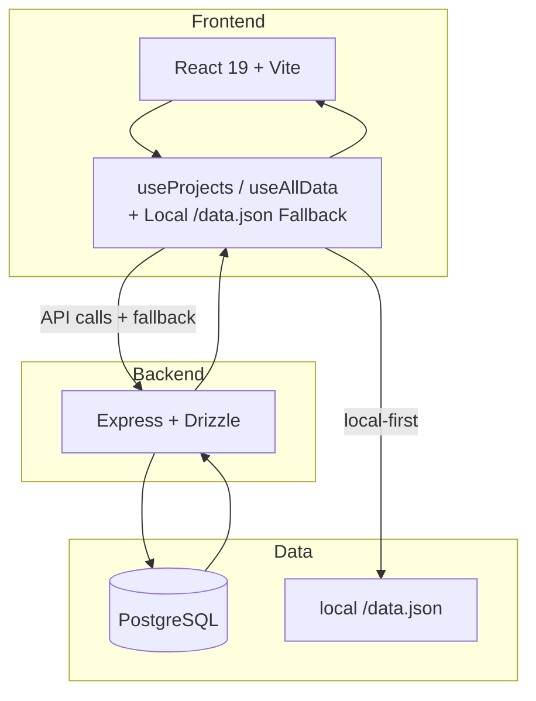
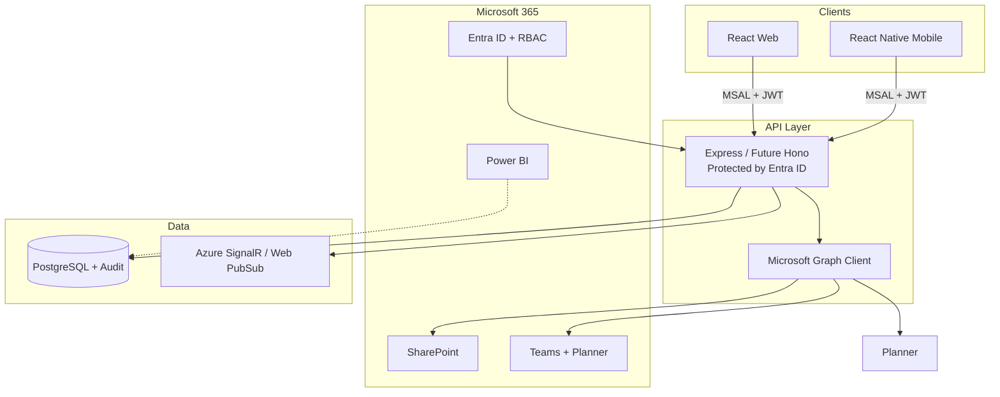

# Bahn Project Manager

> A modern, enterprise-ready platform for managing Deutsche Bahn infrastructure and station development projects across 14 technical departments (Fachbereiche).

[](https://www.typescriptlang.org/)
[](https://react.dev/)
[](https://vitejs.dev/)
[](https://expressjs.com/)
[](https://orm.drizzle.team/)
[](https://vitest.dev/)
[](https://vercel.com/)
[](https://pnpm.io/)

**Current status (May 2026):** Production-ready frontend with rich interactive table, map view, filtering, inline editing, Excel import/export, and audit logging. Data layer is now **local-first and fully reliable** with correct column mapping. Backend API and database schema are implemented. **Microsoft Entra ID SSO integration** is the next major milestone.

---

## Table of Contents
- [Current Progress](#current-progress)
- [Overview](#overview)
- [The Journey](#the-journey-from-excel-to-living-distributed-platform)
- [Key Features](#key-features)
- [Tech Stack](#tech-stack)
- [Architecture](#architecture)
- [Getting Started](#getting-started)
- [Project Structure](#project-structure)
- [Database Schema](#database-schema)
- [Backend API](#backend-api)
- [Frontend Highlights](#frontend-highlights)
- [Authentication & Microsoft 365 Integration](#authentication--microsoft-365-integration)
- [Deployment](#deployment)
- [Roadmap & Next Steps](#roadmap--next-steps)
- [Contributing](#contributing)
- [License](#license)

---

## Current Progress

We have successfully migrated from static Excel workflows to a **modern, living platform**.

| Area                              | Completion | Status          | Notes |
|-----------------------------------|------------|-----------------|-------|
| **Frontend UI/UX & Interactivity** | **95%**    | Excellent       | Polished table, map, inline editing, filters, dark mode |
| **Data Layer & Column Mapping**    | **100%**   | Complete        | Correct `projektnummer` vs `projektstand` separation |
| **Database Schema & Seeding**      | **90%**    | Very Good       | 1,298 records, 14 departments, audit_log |
| **Backend API & Procedures**       | **75%**    | Good            | Express + Drizzle CRUD ready |
| **Real Server State & TanStack Query** | **65%** | Solid           | Local-first + API fallback implemented |
| **Authentication (Microsoft Entra ID)** | **15%** | Early        | Demo mode – architecture ready |
| **Microsoft 365 Interoperability** | **10%**    | Early           | SharePoint, Teams, Planner, Power BI planned |
| **React Native Mobile App**        | **5%**     | Not Started     | Expo + shared types planned |
| **Real-time & Collaboration**      | **15%**    | Early           | Basic audit logging exists |
| **DevOps, Testing & DX**           | **70%**    | Solid           | Vitest, Prettier, Vercel config ready |
| **Overall Platform Maturity**      | **62%**    | Strong Foundation | Excellent UI + reliable data layer |


```mermaid
pie title Platform Completion (May 2026)
    "Frontend & UI" : 95
    "Data Layer & Mapping" : 100
    "Database & Persistence" : 90
    "Backend API Core" : 75
    "Authentication & Security" : 15
    "Microsoft 365 Integration" : 10
    "Mobile & Real-time" : 10
```

**Summary**: Outstanding user interface and a rock-solid, correctly mapped data foundation. The biggest remaining work is **full Microsoft Entra ID SSO**, **real backend synchronization**, and **Microsoft 365 ecosystem integration**.

---

## Overview

**Bahn Project Manager** is a specialized workflow platform for complex Deutsche Bahn infrastructure projects. It centralizes project information, tracks review and approval processes across **14 technical departments** (EEA, ITK, GA, Energie, HFT, HKLS, TBQ, BS, UM, BIM, LST, Vermessung, Baubetriebstechnologie, Baubetriebsplanung), and provides real-time visibility into status, workload, and bottlenecks.

**Core Capabilities**
- Station and line-based project tracking
- Department-specific review cycles (status, reviewer, date)
- Powerful filtering, search, sorting, and inline editing
- Interactive geospatial visualization
- Complete audit trail
- Excel-aligned bulk import/export

The platform is built as a modern full-stack TypeScript monorepo, designed for seamless evolution into the **Microsoft 365 and Azure ecosystem**.

---

## The Journey: From Excel to Living Distributed Platform

```mermaid
journey
    title Migration Journey – Excel to Distributed Platform
    section Phase 1: Static Excel Legacy
      Multiple Excel files per department: 5: Business Users
      Manual updates via email: 3: Business Users
      No single source of truth: 2: Platform Team
    section Phase 2: Modern Web App (Current)
      Interactive React table + Map: 5: Developers
      Centralized PostgreSQL + Audit: 5: Developers
      Inline editing + Excel sync: 4: Business Users
      Correct column mapping (projektnummer / projektstand): 5: Developers
    section Phase 3: Connected Enterprise (Next)
      Microsoft Entra ID SSO + RBAC: 4: Platform Team
      SharePoint document storage: 3: Platform Team
      Teams + Planner integration: 3: Business Users
      Full backend persistence: 5: Developers
    section Phase 4: Fully Distributed
      React Native mobile + offline: 2: Business Users
      Real-time updates (web + mobile): 2: Platform Team
      Power Automate + Azure OpenAI: 2: Platform Team
      Power BI executive dashboards: 3: Management
```

**Goal**: Transform static, error-prone Excel processes into a living, collaborative system that works seamlessly across desktop, mobile, Microsoft Teams, SharePoint, and Power BI.

---

## Key Features

### Current Capabilities (Production Ready)
- **Unified Project Registry** — 1,298+ projects with correct `projektnummer` (G. codes) and `projektstand` (EP/AP/Mieterumbau/EIGV/etc.)
- **14-Department Review Tracking** — Full support for all Fachbereiche with status, Prüfer, and Prüfdatum
- **Advanced Interaction**
  - Global full-text search
  - Filters by Region, Projektleiter, Prüfer, Department, Status
  - Inline cell editing with optimistic updates
  - Corporate DB status color coding
- **Interactive Map View** — Filter-aware Leaflet map
- **Specialized Views** — BVB-EEA and PSV-ITK dedicated pages
- **Excel Alignment** — One-click export + bulk import matching existing templates
- **Audit Logging** — Complete change history
- **Professional UX** — Dark mode, responsive, keyboard-friendly, sticky headers

### Quality & Developer Experience
- Full TypeScript (strict mode)
- Vitest + Prettier
- Drizzle type-safe schema
- Vercel-ready deployment

---

## Tech Stack

**Frontend**
- React 19 + Vite 7 + TypeScript 5.9
- shadcn/ui + Tailwind CSS + Lucide icons
- Leaflet maps + Sonner toasts
- TanStack Query + custom data hooks

**Backend**
- Express (TypeScript)
- Drizzle ORM + PostgreSQL

**Database**
- PostgreSQL (Neon / Vercel Postgres / Supabase recommended)
- Tables: `projects`, `department_reviews`, `audit_log`, specialized extension tables

**Tooling**
- pnpm workspaces
- Vitest
- Vercel (frontend + serverless)

---

## Architecture

**Current Architecture (Reliable & Local-First)**


```mermaid
flowchart TD
    subgraph Frontend
        A[React 19 + Vite]
        B[useProjects / useAllData<br/>+ Local /data.json Fallback]
    end
    subgraph Backend
        C[Express + Drizzle]
    end
    subgraph Data
        D[(PostgreSQL)]
        E[local /data.json]
    end

    A --> B
    B -->|API calls + fallback| C
    B -->|local-first| E
    C --> D
    D --> C
    C --> B
    B --> A
```

**Target Architecture (Microsoft 365 Native)**


```mermaid
flowchart TD
    subgraph Clients
        W[React Web]
        M[React Native Mobile]
    end
    subgraph API Layer
        API[Express / Future Hono<br/>Protected by Entra ID]
        Graph[Microsoft Graph Client]
    end
    subgraph Microsoft 365
        Entra[Entra ID + RBAC]
        SP[SharePoint]
        Teams[Teams + Planner]
        PowerBI[Power BI]
    end
    subgraph Data
        DB[(PostgreSQL + Audit)]
        RT[Azure SignalR / Web PubSub]
    end

    W & M -->|MSAL + JWT| API
    API --> Graph --> SP & Teams & Planner
    API --> DB
    API --> RT
    Entra --> API
    PowerBI -.-> DB
```

---

## Getting Started

### Prerequisites
- Node.js ≥ 20.x
- pnpm ≥ 9.x
- PostgreSQL database

### Installation
```bash
git clone https://github.com/iceccarelli/bahn-project-manager.git
cd bahn-project-manager
pnpm install
```

### Database Setup
```bash
cp .env.example .env
# Set DATABASE_URL
pnpm db:push
```

### Run Locally
```bash
pnpm dev
```

App available at `http://localhost:5173`

---

## Project Structure
```
client/src/
├── components/          # UI components
├── hooks/               # useProjects, useAllData, useFilters...
├── pages/               # Projects.tsx, Dashboard, BVB-EEA, PSV-ITK...
server/
├── _core/               # Express setup
├── procedures/          # Business logic
shared/
└── types.ts             # Unified types
drizzle/
└── schema.ts            # Database schema
```

---

## Database Schema
Core tables:
- `projects` — Master data (with correct `projektnummer` + `projektstand`)
- `department_reviews` — 14 departments per project
- `audit_log` — Immutable history

---

## Backend API
Procedure-style endpoints under `/api`:
- Projects CRUD + advanced filtering
- Department reviews
- Statistics & workload
- Excel import/export
- Audit logging

---

## Frontend Highlights
- **Projects Table** — Sticky columns, expandable department sub-rows, powerful inline editing
- **Map Integration** — Filter-aware Leaflet visualization
- **Dashboard KPIs** — Accurate real-time statistics
- **Excel Alignment** — Perfect match with existing business workflows

---

## Authentication & Microsoft 365 Integration

**Current State:** Demo / mock authentication (fully functional for development).

**Target Architecture (High Priority):**
- Frontend: MSAL.js (`@azure/msal-browser` + `@azure/msal-react`)
- Backend: JWT validation with `@azure/identity`
- RBAC mapped from Microsoft 365 security groups / Entra ID app roles
- Just-in-time provisioning via Microsoft Graph
- SharePoint document libraries per project
- Teams adaptive card notifications on status changes
- Planner / Outlook task synchronization
- Power BI embedded dashboards

**Security Goals:**
- Full SSO with Microsoft Entra ID
- Conditional Access policies
- Least-privilege RBAC
- Audit logging of all authentication events

---

## Deployment
**Vercel (Recommended)**
- Connect GitHub repo
- Add `DATABASE_URL` and Microsoft Entra ID environment variables
- Push to `main`

---

## Roadmap & Next Steps

### High Priority (Next 4–8 Weeks)
1. **Microsoft Entra ID SSO + JWT Protection**
2. **Full Backend Persistence** (replace remaining client-side caching)
3. **SharePoint + Teams Integration**

### Medium Priority
4. **React Native Mobile App** (Expo + offline sync)
5. **Real-time Updates** (Azure SignalR / Web PubSub)
6. **Power BI Embedded Dashboards**

### Long-term Vision
- Power Automate workflows + Azure OpenAI insights
- GitHub Actions CI/CD + Playwright E2E
- i18n + WCAG 2.2 accessibility
- Scalable caching layer

---

## Contributing

We welcome contributions that align with the enterprise vision. Please open an issue first for large features (especially Microsoft 365 integration or mobile).

---

## License

MIT License © 2025–2026 Bahn Project Manager contributors.

---

**Built with care for reliable railway infrastructure project delivery.**

*This README is living documentation. Please keep it updated as the platform evolves.*

*Questions or feedback? Open an issue on GitHub.*
