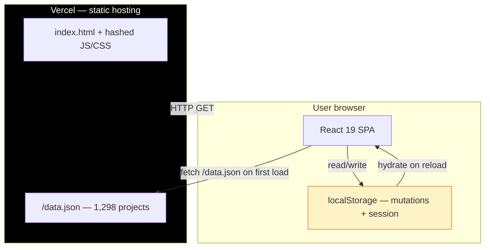
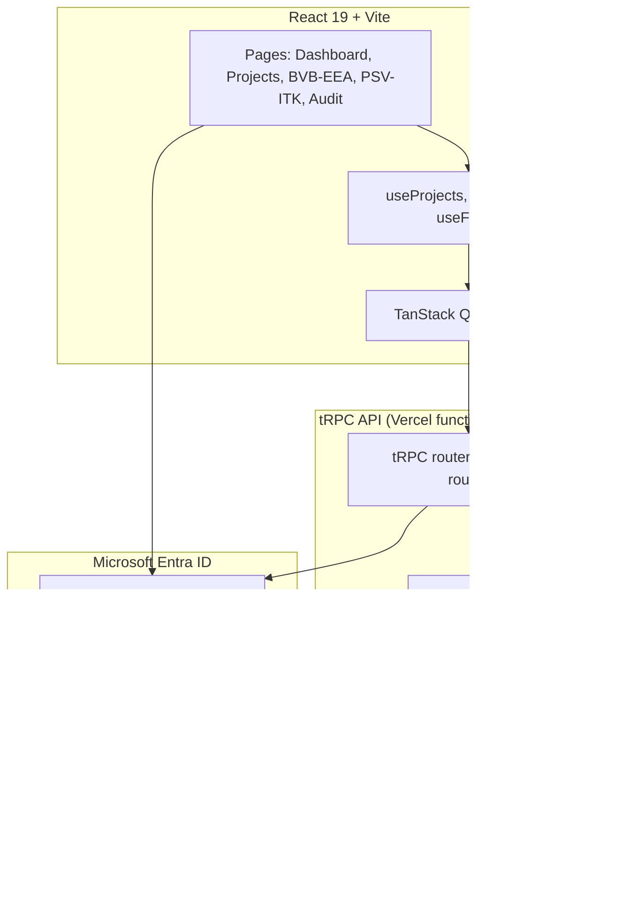

# Bahn Project Manager

> Enterprise platform for managing Deutsche Bahn infrastructure and station‑development projects across 14 technical departments (*Fachbereiche*). Single‑page React app, data‑driven from a 1,298‑project dataset, deployed as a static SPA on Vercel.

[](https://www.typescriptlang.org/)
[](https://react.dev/)
[](https://vitejs.dev/)
[](https://biomejs.dev/)
[](https://vercel.com/)
[]()
[]()
[]()

---

## Verified Status — June 2026

Every row below was confirmed by running the command against `main` (commit `13537e8`) on Node 22 / pnpm 10.15.1. This is not aspirational; it is the measured state of the repository.

### Pipeline — green end to end

| Command | What it does | Result |
|---|---|---|
| `pnpm install --frozen-lockfile` | Install exactly as Vercel/CI do | ✅ passes (see build‑script note below) |
| `pnpm check` (`tsc --noEmit`) | TypeScript typecheck | ✅ **0 errors** |
| `pnpm lint` (`biome check .`) | Linting | ✅ **exit 0**, 297 warnings (non‑blocking) |
| `pnpm test:cov` | Vitest + coverage | ✅ **5 passed, 6 skipped** |
| `pnpm build:client` | The production build Vercel runs | ✅ passes, emits `dist/public/` |
| `pnpm build:parallel` | CI build job (client + server bundle) | ✅ passes |
| `pnpm dev` | Express + Vite dev server | ✅ boots on **http://localhost:3000** |
| GitHub Actions CI | lint‑typecheck → test → build → deploy | ✅ all jobs green; deploy jobs self‑skip without Vercel secrets |

> **Build‑script note.** pnpm 10 blocks post‑install scripts by default and prints `Ignored build scripts: @biomejs/biome, @tailwindcss/oxide, esbuild`. The build still succeeds because those tools ship prebuilt platform binaries as optional dependencies. If you ever see a native‑binary error locally, run `pnpm approve-builds` once. Vercel handles this transparently.

### What works in the browser today

| Area | State | Notes |
|---|---|---|
| Routing | ✅ | `wouter`: `/`, `/projects`, `/bvb-eea`, `/psv-itk`, `/audit`, `/login` |
| Auth gate | ✅ (demo) | `localStorage` session; redirects unauthenticated users to `/login` |
| Dark / light theme | ✅ | `ThemeContext`, synchronous init from `localStorage`, no flash; light is default |
| Data loading | ✅ | 1,298 projects + 18,172 review rows from `/data.json`, cached in `localStorage` |
| Dashboard | ✅ | KPI cards, status distribution, region and *Prüfer* workload charts |
| Projects table | ✅ | 991 lines: inline edit, per‑department review columns, sort, filters, search |
| Add‑Project dialog | ✅ (client‑only) | Cascading Region → Station → Bf‑Nr. dropdowns; writes to `localStorage` |
| Live search | ✅ | Debounced; numeric fields are string‑coerced (the old numeric‑field crash is fixed) |
| Map view | ✅ | Vanilla‑Leaflet rewrite (no re‑init crash), filter‑synced markers |
| BVB‑EEA page | ✅ | Real filtered EEA‑*Freigaben* table (not a placeholder) |
| PSV‑ITK page | ✅ | Filtered ITK view |
| Excel export | ✅ | Client‑side XLSX of the current view |
| Audit log | ✅ (client‑only) | Change history in `localStorage` |

### What is intentionally not wired up yet

| Area | Reality |
|---|---|
| **Persistence** | Everything is `localStorage`‑only. Edits, new projects and audit entries do **not** survive on another device or browser. |
| **Backend** | `server/` (Express + tRPC) and `drizzle/` (MySQL schema) exist and compile, but Vercel serves **static files only** — `vercel.json` defines no API routes. The server is not reachable in production. |
| **Database** | No `DATABASE_URL` is provisioned. `getDb()` returns `null` gracefully. The MySQL schema and seed scripts are ready but unused. |
| **Real auth** | `@azure/msal-browser` / `@azure/msal-react` are installed but not integrated. Login is two hard‑coded demo users. |
| **CI deploy** | Deploy jobs are guarded and skip cleanly unless `VERCEL_TOKEN` etc. are set; Vercel's Git integration handles deploys instead. |

---

## Known real issues (prioritised, evidence‑based)

These are the things genuinely worth fixing. None of them block the build.

1. **Filter dropdowns show dirty data.** `useFilters()` builds option lists with a plain `Set` + `sort`, with no trimming or case‑folding. The dataset contains `"Frankfurt"` vs `"Frankfurt "`, `"Koblenz"` / `"koblenz"` / `"Koblenz "`, `"Gießen"` / `"Gießen "`, plus placeholders `"???"` and `"Bitte auswählen"`, and **113 projects with a null region**. All of these surface as separate filter entries.
2. **No durable persistence.** Mutations live only in `localStorage`. This is the single biggest gap between "demo" and "product."
3. **`projektstand` is free‑text.** 80 distinct values, many one‑offs — they cannot be reliably bucketed for reporting until normalised.
4. **A few lint warnings carry real risk.** Of 297 warnings, only two rules matter for correctness: `noArrayIndexKey` (28 — list keys derived from array index can cause subtle reconciliation bugs) and `useExhaustiveDependencies` (6 — possible stale closures). The remaining ~263 are style (`noExplicitAny` 62, `useImportType` 54, `useLiteralKeys` 19, …).
5. **Single large JS chunk.** The main bundle is ~718 kB (≈215 kB gzip) on top of vendor chunks; route‑level `React.lazy` would cut first‑load cost.
6. **Repo clutter.** One‑shot codemod scripts (`apply-search-fix.mjs`, `check-search.mjs`) and a `client/src/_prototypes/` folder remain in the tree; the dev HTML injects a `__manus__/debug-collector.js`. None affect production, but they should be pruned.
7. **Peer‑dependency warnings.** `react-leaflet@4.2.1` and `@azure/msal-react@2` declare React 18 peers while React 19 is installed — cosmetic, and the Map no longer depends on `react-leaflet` at runtime after the vanilla rewrite.

---

## Architecture

### Today — static SPA


```mermaid
flowchart TD
    subgraph Vercel["Vercel — static hosting"]
        HTML["index.html + hashed JS/CSS"]
        DATA["/data.json — 1,298 projects"]
    end
    subgraph Browser["User browser"]
        REACT["React 19 SPA"]
        LS["localStorage — mutations + session"]
    end
    Vercel -->|HTTP GET| Browser
    REACT -->|fetch /data.json on first load| DATA
    REACT -->|read/write| LS
    LS -->|hydrate on reload| REACT
    style Vercel fill:#000,color:#fff
    style LS fill:#fef3c7,stroke:#d97706
```

### Target — once the backend is deployed


```mermaid
flowchart TD
    subgraph FE["React 19 + Vite"]
        UI["Pages: Dashboard, Projects, BVB-EEA, PSV-ITK, Audit"]
        HOOKS["useProjects, useAllData, useFilters"]
        CACHE["TanStack Query cache"]
    end
    subgraph BE["tRPC API (Vercel functions or dedicated host)"]
        API["tRPC router + Express routes"]
        ORM["Drizzle ORM"]
    end
    subgraph DB["MySQL / PostgreSQL"]
        T[("projects · department_reviews · audit_log · bvb_eea · psv_itk")]
    end
    subgraph AUTH["Microsoft Entra ID"]
        MSAL["MSAL.js + JWT validation"]
    end
    UI --> HOOKS --> CACHE --> API --> ORM --> T
    UI --> MSAL
    API --> MSAL
```

---

## Data model

Each project in `client/public/data.json`:

```json
{
  "id": 1,
  # Projekt Antraggeber (BM) -> 
  "projektnummer": "G.011511006", # Projektnummer OHNE (separat auswählbar) # Projektnummer von BM, von Vermietung, zum Erstellen BS konzepte
  "bahnhofsmanagement": "Kassel", # Region -> BM zu eintragen.
  "station": "Bad Hersfeld", 
  "bahnhofsnummer": null,
  "streckennummer": null,
  "projektbeschreibung": "Erhöhung des Hausbahnsteigs …",
  "projektstand": "EP",
  "projektleiter": "Daniel Röthlinger",
  "terminProjektvorstellung": "2020-08-19", # Projektvorstellung => (Terminauswahlliste) Per Email Informiert ()=>{check.liste.muster}
  # smtp.protocol.IP.standorte
  # Tabelle (Termine FREI und nicht Parallel) 
  # TODO (keine Projektvorstellung Termin) abzugleichen.
  "kommentar": null,
  "projektLink": null,
  "reviews": [
    { "department": "EEA", "status": "Zustimmung erteilt", "prueferName": "Oker", "pruefDatum": "2020-10-15" }
  ] # Checkliste wird Erfolg Vorhanden.  (Falls Projektnummer vorhanden ist ()=> neues anlegen)
}
```

**14 departments:** BIM, BS, Baubetriebsplanung, Baubetriebstechnologie, EEA, Energie, GA, HFT, HKLS, ITK, LST, TBQ, UM, Vermessung.

**Dataset facts (measured):** 1,298 projects · 18,172 review rows · 19 distinct region values (3 differ only by case/whitespace) · 113 null regions · 80 distinct `projektstand` values.

---

## Project structure

```
bahn-project-manager/
├── client/
│   ├── public/data.json            # 1,298 projects — source of truth today
│   ├── index.html
│   └── src/
│       ├── _core/                  # api/client.ts (mock backend), hooks (useAuth…), query setup
│       ├── components/             # DashboardLayout, Header, Map, AuthGate, ErrorBoundary, ui/ (53 files)
│       ├── contexts/ThemeContext.tsx
│       ├── hooks/                  # useDataQuery (main), useData, useStations, useMobile…
│       ├── lib/                    # stationGeo, trpc, utils
│       └── pages/                  # Dashboard, Projects, BvbEea, PsvItk, AuditLog, Login, NotFound
├── server/                         # Express + tRPC — compiles, NOT deployed to Vercel
├── shared/                         # types, Zod validation, constants, OData helpers
├── drizzle/                        # MySQL schema + seed-from-json — ready, not provisioned
├── scripts/                        # seed-perfect, sync-json-db
├── .github/workflows/ci.yml        # lint-typecheck → test → build → guarded deploy
├── biome.json                      # Biome 1.9.4, all rules "warn"
├── vite.config.ts · vercel.json · tsconfig.json · vitest.config.ts
└── package.json                    # pnpm@10.15.1
```

---

## Getting started

**Prerequisites:** Node 20+ (CI uses 22), pnpm 10 (`corepack enable pnpm`).

```bash
git clone https://github.com/iceccarelli/bahn-project-manager.git
cd bahn-project-manager
pnpm install                 # if you see a native-binary error: pnpm approve-builds

pnpm dev                     # Express + Vite → http://localhost:3000
                             # login: admin@bahn.de / admin  (or pruefer@bahn.de / user)
```

Quality gates:

```bash
pnpm check                   # tsc --noEmit            → 0 errors
pnpm lint                    # biome check .           → exit 0 (warnings only)
pnpm test:cov                # vitest + coverage       → 5 passed, 6 skipped
pnpm build                   # vite build → dist/public (what Vercel runs)
```

**Deployment.** Push to `main`; Vercel auto‑deploys with `installCommand: pnpm install --frozen-lockfile`, `buildCommand: pnpm build:client`, `outputDirectory: dist/public`, and an SPA fallback rewrite to `/index.html`.

---

## Roadmap (in priority order)

### P0 — Data hygiene (highest ROI, ~half a day, no infra)
- Normalise filter options at read time in `useFilters()`: trim, case‑fold, drop `"???"` / `"Bitte auswählen"`, and label null regions as *"Ohne Zuordnung"* instead of hiding them.
- Add a one‑off cleanup script that rewrites `data.json` canonically (merge `Koblenz` variants, etc.) so the underlying data is fixed, not just masked.
- Map the 80 `projektstand` strings to a small canonical set (EP, AP, EIGV, Mieterumbau, Gestoppt, Sonstiges).

### P1 — Persistence
- Provision a database (PlanetScale/TiDB for the existing MySQL schema, or migrate to Postgres — the `postgres` driver is already a dependency), set `DATABASE_URL`, run `pnpm db:push`, seed via `pnpm seed:perfect`.
- Expose the tRPC router as Vercel serverless functions (`api/trpc/[trpc].ts`) and add the `/api/**` rewrite to `vercel.json`.
- Switch `_core/api/client.ts` from `localStorage` to real `fetch('/api/trpc/…')`; keep `localStorage` as an offline cache only.

### P2 — Real authentication
- Register an Entra ID app, wire `msalInstance.loginPopup()` in place of `loginDemo()`, validate JWTs server‑side, and map security groups to admin/user roles. Remove the hard‑coded demo users.

### P3 — Quality & performance
- Fix the two correctness lint families (`noArrayIndexKey`, `useExhaustiveDependencies`); then progressively clear the style warnings or relax those rules in `biome.json` deliberately.
- Route‑level `React.lazy` + `Suspense` to split the ~718 kB main chunk.
- Delete repo clutter (`apply-search-fix.mjs`, `check-search.mjs`, `client/src/_prototypes/`), and strip the `__manus__` debug injector from production HTML.

### P4 — Microsoft 365 & beyond
- SharePoint document libraries per project, Teams adaptive cards on status change, Planner sync for review deadlines (Microsoft Graph). E2E tests with Playwright (already a dev dependency). Optional Expo mobile client sharing `shared/` types.

---

## Tech stack

| Layer | Technology | Status |
|---|---|---|
| UI | React 19 · Vite 7 · TypeScript 5.9 | ✅ |
| Components | shadcn/ui · Radix · Tailwind 4 | ✅ |
| Routing | wouter | ✅ |
| Data/cache | TanStack Query 5 (client‑only) | ✅ |
| Maps | Leaflet (vanilla) | ✅ |
| Lint | Biome 1.9.4 (warnings only) | ✅ |
| Tests | Vitest 2 | ✅ 5 passed / 6 skipped |
| Deploy | Vercel (static SPA) | ✅ |
| Backend | Express + tRPC 11 | ⏸ compiles, not deployed |
| ORM / DB | Drizzle 0.44 / MySQL schema | ⏸ ready, not provisioned |
| Auth | MSAL packages | ⏸ installed, not integrated |

---

## Contributing

1. Branch from `main` (`git checkout -b fix/your-change`).
2. Keep the gates green: `pnpm check` (0 errors), `pnpm lint` (exit 0), `pnpm build`.
3. Open a PR; CI runs lint‑typecheck → test → build automatically.

## License

MIT © 2025–2026 Bahn Project Manager contributors.

---

*This README reflects the measured state of `main` (commit `13537e8`) as of June 2026. Every status claim above was verified by executing the corresponding command.*
