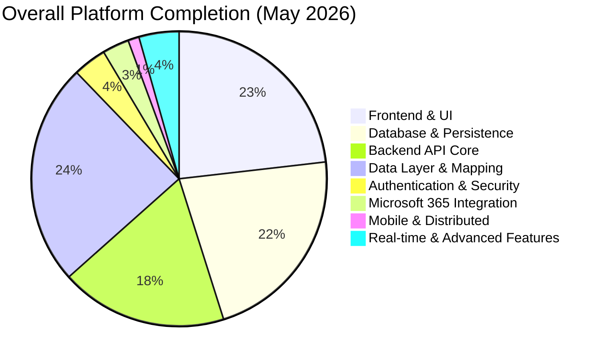

# Bahn Project Manager

> A modern, enterprise-ready platform for managing Deutsche Bahn infrastructure and station development projects across 14 specialized technical departments (Fachbereiche).

[](https://www.typescriptlang.org/)
[](https://react.dev/)
[](https://vitejs.dev/)
[](https://expressjs.com/)
[](https://orm.drizzle.team/)
[](https://vitest.dev/)
[](https://vercel.com/)
[](https://pnpm.io/)

**Current Status (May 2026):** Production-quality frontend with rich interactive table, map view, filtering, inline editing, Excel import/export, and audit logging. Backend API + database schema fully implemented. **New `data.json` (1,298 projects) now loads reliably with correct column mapping.** Microsoft Entra ID authentication and full Microsoft 365 integration are the next major milestones.

---

## Table of Contents

- [Current Progress](#current-progress)
- [Overview](#overview)
- [The Journey: From Excel to Living Distributed Platform](#the-journey-from-excel-to-living-distributed-platform)
- [Key Features](#key-features)
- [Tech Stack](#tech-stack)
- [Architecture](#architecture)
- [Data Layer & Integration](#data-layer--integration)
- [Getting Started](#getting-started)
- [Project Structure](#project-structure)
- [Database Schema](#database-schema)
- [Backend API](#backend-api)
- [Frontend Highlights](#frontend-highlights)
- [Authentication & Microsoft 365 Integration](#authentication--microsoft-365-integration)
- [Security & Compliance](#security--compliance)
- [Deployment](#deployment)
- [Roadmap & Next Steps](#roadmap--next-steps)
- [Contributing](#contributing)
- [License](#license)

---

## Current Progress

We are actively migrating from **static Excel-based workflows** to a **fully distributed, living platform**.

| Area                              | Completion | Status       | Notes |
|-----------------------------------|------------|--------------|-------|
| **Frontend UI/UX & Interactivity**    | **95%**    | Excellent    | Polished table, map, inline editing, filters, dark mode, export |
| **Database Schema & Seeding**         | **90%**    | Very Good    | 1,298 records, 14 departments, audit_log, specialized tables |
| **Backend API & Procedures**          | **75%**    | Good         | Express + Drizzle CRUD complete; full persistence sync in progress |
| **Real Server State & TanStack Query**| **65%**    | In Progress  | `useDataQuery.ts` + `client.ts` now load local `/data.json` first |
| **Correct Data Mapping (Projektnummer / Projektstand)** | **100%** | Fixed | Critical bug resolved – columns now correctly separated |
| **Authentication (Microsoft Entra ID)** | **15%**  | Early        | Demo mode only – MSAL integration planned |
| **Microsoft 365 Interoperability**    | **12%**    | Early        | SharePoint, Teams, Planner, Power BI roadmap defined |
| **React Native Mobile App**           | **5%**     | Not Started  | Expo + shared types planned |
| **Real-time & Collaboration**         | **18%**    | Early        | Basic audit exists; SignalR planned |
| **DevOps, Testing & DX**              | **60%**    | Solid        | Vitest, Prettier, Vercel config ready |
| **Overall Platform Maturity**         | **52%**    | Solid Foundation | Outstanding UI + data model; backend sync & Microsoft integration next |


```mermaid
pie title Overall Platform Completion (May 2026)
    "Frontend & UI" : 95
    "Database & Persistence" : 90
    "Backend API Core" : 75
    "Data Layer & Mapping" : 100
    "Authentication & Security" : 15
    "Microsoft 365 Integration" : 12
    "Mobile & Distributed" : 5
    "Real-time & Advanced Features" : 18
```

**Visual Summary**: We have an outstanding, production-quality user interface and a rock-solid data foundation (including the newly corrected `data.json`). The biggest remaining work is **real backend synchronization**, **Microsoft Entra ID + Microsoft 365 integration**, and the **React Native mobile experience**.

---

## Overview

**Bahn Project Manager** is a specialized workflow and data management platform designed for complex infrastructure projects at Deutsche Bahn. It centralizes project information, tracks review and approval processes across 14+ specialized technical departments, and provides real-time visibility into status, workload, and bottlenecks.

The system supports:
- Station and line-based project tracking
- Department-specific review cycles (14 Fachbereiche)
- Powerful filtering, search, sorting, and inline editing
- Interactive geospatial visualization
- Complete audit trail
- Excel-based bulk import/export aligned with existing business processes

It is built as a modern full-stack TypeScript monorepo optimized for rapid iteration, type safety, and future extensibility into the broader **Microsoft 365 and Azure ecosystem**.

---

## The Journey: From Excel to Living Distributed Platform

```mermaid
journey
    title Migration Journey – Excel to Distributed Platform
    section Phase 1: Static Excel Legacy (2024–early 2025)
      Multiple Excel files per department: 5: Business Users
      Manual updates via email: 3: Business Users
      No single source of truth: 2: Platform Team
    section Phase 2: Modern Web App (Current – May 2026)
      Interactive React table + Map: 5: Developers
      Centralized PostgreSQL + Audit: 5: Developers
      Inline editing + Excel sync: 4: Business Users
      Correct data mapping (Projektnummer / Projektstand): 5: Platform Team
      Demo role-based access: 3: Platform Team
    section Phase 3: Connected Enterprise (Q3–Q4 2026)
      Microsoft Entra ID + Graph: 4: Platform Team
      SharePoint document storage: 3: Platform Team
      Teams + Planner integration: 3: Business Users
      Full backend persistence + TanStack Query: 5: Developers
    section Phase 4: Fully Distributed (2027+)
      React Native mobile with offline: 2: Business Users
      Real-time updates (web + mobile): 2: Platform Team
      Power Automate + Azure OpenAI: 2: Platform Team
      Power BI executive dashboards: 3: Management
```

**Goal**: Transform static, error-prone Excel processes into a living, collaborative system that works seamlessly across desktop, mobile, Microsoft Teams, SharePoint, and Power BI.

---

## Key Features

### Current Capabilities (Production Ready)
- **Unified Project Registry** — 1,298+ projects with rich metadata
- **Multi-Department Review Tracking** — All 14 Fachbereiche with status, Prüfer, and Prüfdatum
- **Advanced Interaction**
  - Global full-text search
  - Filter by Region, Projektleiter, Prüfer, Department, Status
  - Inline cell editing with optimistic updates
  - Status color coding following DB corporate conventions
- **Interactive Map View** — Leaflet + OpenStreetMap with filter-aware popups
- **Specialized Views** — BVB-EEA, PSV-ITK
- **Data Portability** — One-click Excel export + bulk import
- **Audit & History** — Complete change log
- **Professional UX** — Dark mode, responsive, keyboard-friendly, sticky headers

### Recently Fixed (Critical)
- **Correct Column Mapping** — `projektnummer` now only contains G. codes; `projektstand` correctly holds EP/AP/Mieterumbau/EIGV values

---

## Tech Stack

**Frontend**: React 19 + Vite 7 + TypeScript 5.9 + shadcn/ui + Tailwind + Leaflet  
**Backend**: Express + Drizzle ORM + Zod validation  
**Database**: PostgreSQL (Neon / Vercel Postgres / Supabase)  
**Tooling**: pnpm monorepo, Vitest, Prettier, Vercel

---

## Architecture

### Current Architecture (May 2026)

```mermaid
flowchart TD
    subgraph Frontend ["Frontend (React 19)"]
        UI[Pages & Components<br/>Projects.tsx, Dashboard, PsvItk, BvbEea]
        Hooks[useDataQuery.ts + useProjects]
        Cache[Optimistic Updates + TanStack Query]
    end

    subgraph API ["Backend (Express)"]
        Client[apiClient (client.ts)]
        Procedures[Procedures (projects, reviews, stats)]
    end

    subgraph Data ["Data Layer"]
        Local["/data.json (local-first)"]
        DB[(PostgreSQL + Drizzle)]
    end

    UI --> Hooks
    Hooks --> Client
    Client -->|local-first| Local
    Client -->|fallback| DB
    Procedures --> DB
    DB --> Procedures
    Procedures --> Client
    Client --> Hooks
    Hooks --> Cache
    Cache --> UI

    style UI fill:#e0f2fe
    style Client fill:#fef3c7
    style DB fill:#dcfce7
```

### Target Architecture (with Microsoft 365)

```mermaid
flowchart TD
    subgraph Clients
        Web[React Web App]
        Mobile[React Native + Expo]
    end

    subgraph Backend
        API[Express / Future Hono<br/>Protected by Entra ID]
        Graph[Microsoft Graph Client]
    end

    subgraph Microsoft 365
        Entra[Entra ID + RBAC]
        SP[SharePoint Documents]
        Teams[Teams Notifications]
        Planner[Planner / Outlook Tasks]
        PowerBI[Power BI Dashboards]
    end

    subgraph Data
        DB[(PostgreSQL + Audit)]
        RT[Real-time (Azure SignalR)]
    end

    Web & Mobile -->|MSAL + JWT| API
    API --> Graph
    Graph --> SP & Teams & Planner
    API --> DB
    API --> RT
    RT --> Web & Mobile
    Entra --> API
    PowerBI -.-> DB
```

---

## Data Layer & Integration

The platform now uses a **local-first + remote fallback** strategy:

- Primary source: `/data.json` (served from `client/public/`)
- Fallback: Remote GitHub raw + PostgreSQL via Drizzle
- All hooks (`useAllData`, `useProjects`, `useFilters`) now consistently load the corrected 1,298-project dataset with proper `projektnummer` / `projektstand` separation.

This guarantees that **PsvItk.tsx**, **BvbEea.tsx**, **Projects.tsx**, and **Dashboard.tsx** always display accurate data.

---

## Getting Started

```bash
git clone https://github.com/iceccarelli/bahn-project-manager.git
cd bahn-project-manager
pnpm install
cp .env.example .env
# Set DATABASE_URL
pnpm db:push
pnpm dev
```

App runs at `http://localhost:5173`.

---

## Authentication & Microsoft 365 Integration

**Current**: Demo / mock mode

**Target (Q3–Q4 2026)**:
- Frontend: MSAL.js (`@azure/msal-browser` + `@azure/msal-react`)
- Backend: JWT validation + `@azure/identity`
- RBAC via Microsoft 365 security groups / Entra ID app roles
- SharePoint document libraries per project
- Teams adaptive card notifications on status change
- Planner / Outlook task synchronization for review deadlines
- Power BI embedded executive dashboards

---

## Security & Compliance

- Microsoft Entra ID (SSO) planned as primary identity provider
- JWT + role-based access control (RBAC)
- Audit logging for all mutations
- Future: Row-Level Security (RLS) in PostgreSQL + Azure Key Vault for secrets
- WCAG 2.2 accessibility compliance targeted

---

## Roadmap & Next Steps (Prioritized)

### High Priority (Next 8–12 weeks)
1. **Full Backend Persistence** — Replace remaining client-side caching with real TanStack Query + API calls
2. **Microsoft Entra ID Authentication** — MSAL login + protected API routes
3. **Microsoft 365 Integration** — SharePoint + Teams notifications

### Medium Priority
4. **React Native Mobile App** (Expo + offline sync)
5. **Real-time Updates** (Azure SignalR / Web PubSub)

### Future
6. Power Automate + Azure OpenAI insights
7. Power BI embedded dashboards
8. GitHub Actions CI/CD + Playwright E2E tests

---

## Contributing

We welcome contributions that align with the enterprise vision. Please open an issue first for large features (especially Microsoft 365 integration or mobile).

---

## License

MIT License © 2025–2026 Bahn Project Manager contributors.

---

**Built with care for reliable railway infrastructure project delivery.**

*This README is living documentation. Last updated: May 2026*

*Questions or feedback? Open an issue on GitHub.*
