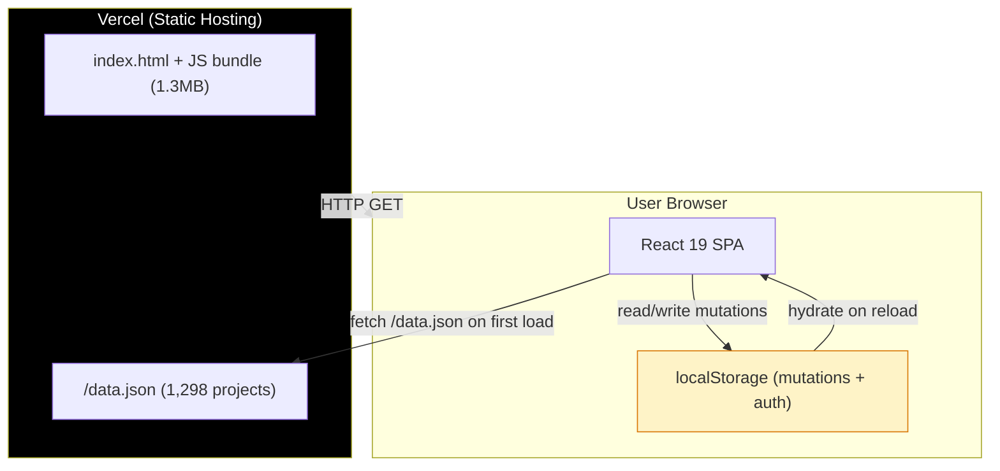
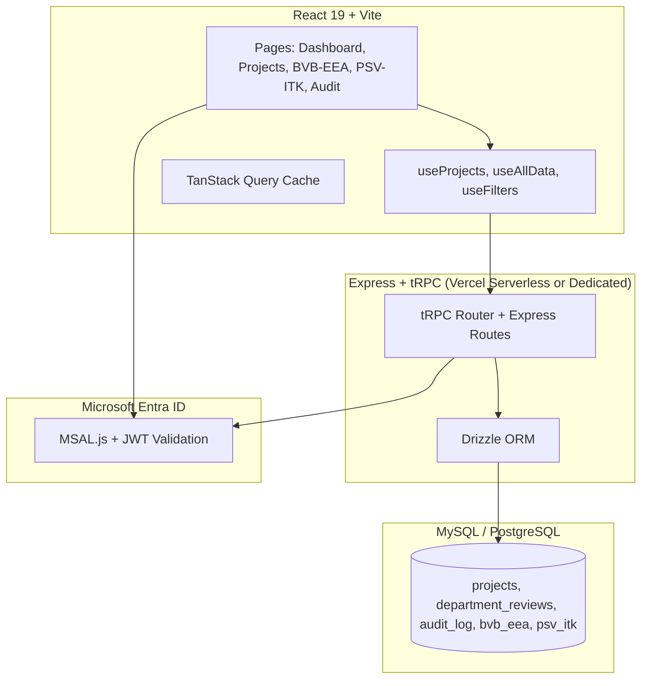

# Bahn Project Manager

> Enterprise platform for managing Deutsche Bahn infrastructure and station development projects across 14 technical departments (Fachbereiche).

[](https://www.typescriptlang.org/)
[](https://react.dev/)
[](https://vitejs.dev/)
[](https://orm.drizzle.team/)
[](https://vercel.com/)
[]()
[]()

---

## Brutally Honest Status (May 2026)

This section tells the truth about what works, what is broken, and what is missing.

### What Works Right Now

| Component | Status | Evidence |
|-----------|--------|----------|
| **Vite Build** | Passing | `pnpm build` produces clean output, 0 errors |
| **TypeScript** | 0 errors | `npx tsc --noEmit` returns clean |
| **Vercel Deployment** | Live | Static SPA at `dist/public/`, `vercel.json` configured correctly |
| **Data Loading** | Working | 1,298 projects loaded from `/data.json` via `localStorage` cache |
| **Login Flow** | Working (Demo) | `admin@bahn.de`/`admin` and `pruefer@bahn.de`/`user` via `localStorage` |
| **Routing** | Working | `/`, `/projects`, `/bvb-eea`, `/psv-itk`, `/audit`, `/login` via `wouter` |
| **Dark/Light Mode** | Working | `ThemeContext` with `localStorage` persistence, no flash |
| **Dashboard** | Working | KPI cards, charts, status distribution from 1,298 projects |
| **Projects Table** | Working | Inline editing, filters, search, sorting, 947 lines |
| **Map View** | Working | Leaflet markers with city coordinates, filter-synced |
| **Excel Export** | Working (Client-side) | XLSX generation from current view |
| **Audit Log** | Working (Client-side) | Change tracking in `localStorage` |

### What Is Broken or Incomplete

| Component | Status | Problem |
|-----------|--------|---------|
| **GitHub Actions CI** | Failing | `pnpm lint` calls `biome check .` — 134 lint errors remain (mostly a11y: `useButtonType`, `noArrayIndexKey`, `noStaticElementInteractions`). CI also calls `pnpm test:cov` which requires a DB connection that does not exist in CI. |
| **Backend Server** | Not functional in production | Express + tRPC server exists but Vercel deployment is static-only. No serverless functions configured. Server code is dead weight in production. |
| **Database** | Not connected | Schema is MySQL (drizzle-orm/mysql2) but no `DATABASE_URL` configured anywhere. `getDb()` returns `null` gracefully. All data comes from static `data.json`. |
| **Authentication** | Demo only | `localStorage`-based mock. No real Microsoft Entra ID / MSAL integration. The `@azure/msal-browser` and `@azure/msal-react` packages are installed but unused. |
| **Data Persistence** | None | All mutations (inline edits, new projects, review updates) are stored in `localStorage` only. Refresh on a new device loses all changes. |
| **BVB-EEA Page** | Minimal | 107 lines, placeholder view |
| **PSV-ITK Page** | Minimal | 107 lines, placeholder view |
| **"Add New Project" Button** | Client-only | Creates a project in `localStorage`, not persisted to any backend |
| **Filter Data Quality** | Dirty | Regions include duplicates (`Koblenz`, `Koblenz `, `koblenz`), placeholders (`???`, `Bitte auswählen`). 113 projects have null region. |
| **Biome Linter** | 134 errors | Config migrated from v1.9.4 to v2.4.16. Remaining: 36 `useButtonType`, 29 `noArrayIndexKey`, 16 `noInnerDeclarations`, 16 `noLabelWithoutControl`, 10 `noArguments` |
| **Tests** | Not runnable | `vitest run` requires DB connection. No unit tests for frontend components. |
| **React Peer Dependencies** | Warnings | `react-leaflet@4.2.1` and `@azure/msal-react@2.2.0` expect React 18, but React 19 is installed. |

### What Does Not Exist Yet

| Feature | Current State |
|---------|---------------|
| Real database connection | Schema exists, no deployment |
| Server-side API (production) | Code exists, not deployed |
| Microsoft Entra ID SSO | Packages installed, zero integration |
| SharePoint / Teams / Planner | Not started |
| Real-time collaboration | Not started |
| Mobile app (React Native) | Not started |
| E2E tests (Playwright) | Not started |
| Role-based access control (real) | Demo roles in localStorage |
| Excel Import (server-side) | Server code exists, not reachable in production |

---

## Architecture

### Current Reality (Static SPA)


```mermaid
flowchart TD
    subgraph Vercel["Vercel (Static Hosting)"]
        HTML["index.html + JS bundle (1.3MB)"]
        DATA["/data.json (1,298 projects)"]
    end

    subgraph Browser["User Browser"]
        REACT["React 19 SPA"]
        LS["localStorage (mutations + auth)"]
    end

    Vercel -->|"HTTP GET"| Browser
    REACT -->|"fetch /data.json on first load"| DATA
    REACT -->|"read/write mutations"| LS
    LS -->|"hydrate on reload"| REACT

    style Vercel fill:#000,color:#fff
    style LS fill:#fef3c7,stroke:#d97706
```

**The backend server code exists but is not deployed.** Vercel serves only the static `dist/public/` directory. There are no serverless functions, no API routes, no database connection in production.

### Target Architecture (Not Yet Implemented)


```mermaid
flowchart TD
    subgraph Frontend["React 19 + Vite"]
        UI["Pages: Dashboard, Projects, BVB-EEA, PSV-ITK, Audit"]
        HOOKS["useProjects, useAllData, useFilters"]
        CACHE["TanStack Query Cache"]
    end

    subgraph Backend["Express + tRPC (Vercel Serverless or Dedicated)"]
        API["tRPC Router + Express Routes"]
        DRIZZLE["Drizzle ORM"]
    end

    subgraph Database["MySQL / PostgreSQL"]
        DB[("projects, department_reviews, audit_log, bvb_eea, psv_itk")]
    end

    subgraph Auth["Microsoft Entra ID"]
        MSAL["MSAL.js + JWT Validation"]
    end

    UI --> HOOKS --> API
    API --> DRIZZLE --> DB
    UI --> MSAL
    API --> MSAL
```

---

## Data Model

### data.json Structure (Source of Truth Today)

Each of the 1,298 projects has this shape:

```json
{
  "id": 1,
  "projektnummer": "G.011511006",
  "bahnhofsmanagement": "Kassel",
  "station": "Bad Hersfeld",
  "bahnhofsnummer": null,
  "streckennummer": null,
  "projektbeschreibung": "Erhoehung des Hausbahnsteig...",
  "projektstand": "EP",
  "projektleiter": "Daniel Roethlinger",
  "terminProjektvorstellung": "2020-08-19",
  "kommentar": null,
  "projektLink": null,
  "reviews": [
    { "department": "EEA", "status": "Zustimmung erteilt", "prueferName": "Oker", "pruefDatum": "2020-10-15" }
  ]
}
```

### 14 Departments (Fachbereiche)

BIM, BS, Baubetriebsplanung, Baubetriebstechnologie, EEA, Energie, GA, HFT, HKLS, ITK, LST, TBQ, UM, Vermessung

### 14 Review Statuses

`Zustimmung erteilt`, `in Bearbeitung`, `offen`, `nicht erforderlich`, `Pruefung erfolgt`, `Nachforderung`, `prueffaehig`, `abgelehnt`, `gestoppt`, `zurueckgestellt`, `Projektkonfig.`, `Projektkonfiguration`, `Niederschrift erstellt`, `Niederschrift erstellt (LP05-05-01-F31)`

### Data Quality Issues (Must Be Fixed)

| Issue | Count | Impact |
|-------|-------|--------|
| Null `bahnhofsmanagement` (Region) | 113 | Filter shows empty entries |
| Duplicate regions (`Koblenz` vs `Koblenz ` vs `koblenz`) | 5 variants | Filters show duplicates |
| Placeholder values (`???`, `Bitte auswählen`) | Present | Pollutes dropdowns |
| Leading whitespace in `projektleiter` | Multiple | Duplicate filter entries |
| 80 unique `projektstand` values (many are free-text) | 80 | Cannot reliably categorize |

---

## Project Structure

```
bahn-project-manager/
├── client/
│   ├── public/data.json              # 1,298 projects (SOURCE OF TRUTH)
│   ├── src/
│   │   ├── _core/
│   │   │   ├── api/client.ts         # Mock API client (localStorage-based)
│   │   │   ├── hooks/useAuth.ts      # Demo auth (localStorage)
│   │   │   ├── hooks/usePresence.ts  # Presence indicators
│   │   │   └── query/                # TanStack Query setup
│   │   ├── components/
│   │   │   ├── AuthGate.tsx          # Route guard (demo)
│   │   │   ├── DashboardLayout.tsx   # Sidebar + header + footer
│   │   │   ├── Header.tsx            # Search + theme toggle
│   │   │   ├── Map.tsx               # Leaflet map (423 lines)
│   │   │   └── ui/                   # shadcn/ui components (50+ files)
│   │   ├── contexts/ThemeContext.tsx  # Dark/light mode
│   │   ├── hooks/
│   │   │   ├── useDataQuery.ts       # Main data hook (TanStack Query)
│   │   │   ├── useData.ts            # Legacy data hook
│   │   │   └── useComposition.ts     # Composition utilities
│   │   └── pages/
│   │       ├── Dashboard.tsx          # KPIs + charts (841 lines)
│   │       ├── Projects.tsx           # Main table (947 lines)
│   │       ├── BvbEea.tsx             # Placeholder (107 lines)
│   │       ├── PsvItk.tsx             # Placeholder (107 lines)
│   │       ├── AuditLog.tsx           # Change history
│   │       ├── Login.tsx              # Demo login form
│   │       └── ComponentShowcase.tsx  # Dev-only UI showcase
│   └── tailwind.config.ts
├── server/                            # EXISTS BUT NOT DEPLOYED
│   ├── _core/index.ts                # Express entry point
│   ├── _core/trpc.ts                 # tRPC setup
│   ├── routers.ts                    # tRPC procedures
│   ├── db.ts                         # getDb() returns null without DATABASE_URL
│   ├── excel.ts                      # Server-side Excel import/export
│   ├── odata/router.ts              # OData-style query endpoint
│   ├── sync-db.ts                   # JSON-to-DB sync logic
│   └── storage.ts                   # File storage
├── shared/
│   ├── types.ts                     # Shared TypeScript interfaces
│   ├── validation.ts                # Zod schemas (Zod 4)
│   ├── const.ts                     # Constants (departments, statuses)
│   └── server/odata.ts             # OData query parsing
├── drizzle/
│   ├── schema.ts                    # MySQL table definitions
│   ├── relations.ts                 # Drizzle relations
│   └── seed-from-json.ts           # Seed DB from data.json
├── scripts/
│   ├── seed-perfect.ts             # Alternative seeder
│   └── sync-json-db.ts            # Bidirectional sync script
├── .github/workflows/ci.yml        # CI pipeline (CURRENTLY FAILING)
├── biome.json                       # Linter config (v2.4.16)
├── tsconfig.json                    # TypeScript config (strict, 0 errors)
├── vite.config.ts                   # Client build config
├── vercel.json                      # Static SPA deployment
└── package.json                     # Scripts + dependencies
```

---

## Getting Started

### Prerequisites

- **Node.js** 20+ (LTS)
- **pnpm** 9+ (`corepack enable pnpm`)

### Installation

```bash
git clone https://github.com/iceccarelli/bahn-project-manager.git
cd bahn-project-manager
pnpm install
```

### Development

```bash
pnpm dev
```

Opens at `http://localhost:5173`. Login with `admin@bahn.de` / `admin`.

### Build and Verify

```bash
pnpm build        # Client only (what Vercel runs)
pnpm check        # TypeScript type checking (0 errors)
pnpm lint         # Biome linting (134 warnings/errors remain)
```

### Deployment (Vercel)

Push to `main`. Vercel auto-deploys using:
- `installCommand`: `pnpm install --frozen-lockfile`
- `buildCommand`: `pnpm build:client`
- `outputDirectory`: `dist/public`
- SPA fallback: all routes rewrite to `/index.html`

---

## What Must Be Done (Priority Order)

### P0 — Fix CI Pipeline (Blocks All Future Work)

| Task | Effort | Details |
|------|--------|---------|
| Ensure `@biomejs/biome` is in `devDependencies` | Done | `pnpm add -D @biomejs/biome` already executed |
| Fix 134 Biome lint errors OR relax rules | 30 min | Add `type="button"` to 36 buttons, use stable keys instead of array index (29), move inner declarations (16) |
| Fix `pnpm test:cov` in CI | 10 min | Skip tests in CI until DB exists, or mock the database |
| Commit lockfile with biome | 1 min | `git add -A && git commit && git push` |

### P1 — Data Quality Cleanup

| Task | Effort | Details |
|------|--------|---------|
| Normalize region names | 1 hour | Trim whitespace, fix casing (`koblenz` to `Koblenz`), merge `Koblenz LOS 2/3/4`, remove `???` and `Bitte auswählen` |
| Normalize `projektleiter` names | 1 hour | Trim whitespace, deduplicate |
| Categorize `projektstand` | 2 hours | Map 80 free-text values to canonical categories (EP, AP, EIGV, Mieterumbau, Gestoppt, Sonstiges) |
| Fill null `bahnhofsmanagement` | 1 hour | 113 projects without region |

### P2 — Connect Real Database

| Task | Effort | Details |
|------|--------|---------|
| Choose DB provider | Decision | Schema is MySQL (drizzle-orm/mysql2). Options: PlanetScale, TiDB Cloud, Railway, or migrate to PostgreSQL |
| Set up `DATABASE_URL` | 30 min | Create instance, add env var to Vercel |
| Run migrations | 30 min | `pnpm db:push` |
| Seed from data.json | 30 min | `pnpm seed:perfect` (1,298 projects + 18,172 reviews) |
| Switch client from localStorage to real API | 4 hours | Replace mock `apiClient` with real `fetch('/api/trpc/...')` |

### P3 — Deploy Backend

| Task | Effort | Details |
|------|--------|---------|
| Convert to Vercel Serverless Functions | 4 hours | Move tRPC to `api/trpc/[trpc].ts` |
| OR deploy Express separately | 2 hours | Railway, Render, or Fly.io |
| Update `vercel.json` with API rewrites | 30 min | `/api/**` to serverless |
| Remove localStorage fallback | 1 hour | Once real API is live |

### P4 — Real Authentication

| Task | Effort | Details |
|------|--------|---------|
| Register Azure AD App | 1 hour | Azure Portal, configure redirect URIs |
| Implement MSAL login flow | 4 hours | Replace `loginDemo()` with `msalInstance.loginPopup()` |
| Add JWT validation to backend | 2 hours | Verify tokens on every request |
| Map Entra ID groups to roles | 2 hours | Admin vs User from security groups |
| Remove demo auth code | 30 min | Delete hardcoded users |

### P5 — UI/UX Polish

| Task | Effort | Details |
|------|--------|---------|
| Add `type="button"` to all non-submit buttons | 30 min | 36 Biome violations |
| Replace `key={index}` with stable keys | 1 hour | 29 instances |
| BVB-EEA page: build real content | 4 hours | Currently placeholder |
| PSV-ITK page: build real content | 4 hours | Currently placeholder |
| Fix filter dropdowns showing dirty data | 1 hour | Trim, deduplicate, sort |
| Code-split the 1.3MB bundle | 2 hours | `React.lazy()` + `Suspense` |

### P6 — Microsoft 365 Integration

| Task | Effort | Details |
|------|--------|---------|
| SharePoint document libraries per project | 8 hours | Microsoft Graph API |
| Teams adaptive cards on status change | 4 hours | Webhook + card template |
| Planner task sync for review deadlines | 4 hours | Graph API |
| Power BI embedded dashboards | 8 hours | Embed token + iframe |

### P7 — Mobile App

| Task | Effort | Details |
|------|--------|---------|
| Expo + React Native scaffold | 4 hours | Shared types from `shared/` |
| Offline-first with SQLite | 8 hours | Expo SQLite + sync |
| Push notifications | 4 hours | Azure Notification Hubs |

---

## Tech Stack

| Layer | Technology | Version | Status |
|-------|-----------|---------|--------|
| Frontend Framework | React | 19.2.1 | Working |
| Build Tool | Vite | 7.1.9 | Working |
| Language | TypeScript | 5.9 | 0 errors |
| UI Components | shadcn/ui + Radix | Latest | Working |
| Styling | Tailwind CSS | 4.x | Working |
| Routing | wouter | Latest | Working |
| State/Cache | TanStack Query | 5.x | Working (client-only) |
| Maps | Leaflet + react-leaflet | 4.2.1 | Working (React 18 peer warning) |
| Icons | Lucide React | Latest | Working |
| Toasts | Sonner | Latest | Working |
| Backend | Express + tRPC | 4.21 / 11.x | Code exists, not deployed |
| ORM | Drizzle | 0.44 | Schema defined, not connected |
| Database | MySQL (schema) | - | Not provisioned |
| Auth | MSAL (packages) | 3.24 / 2.2 | Installed, not integrated |
| Linter | Biome | 2.4.16 | 134 remaining issues |
| Testing | Vitest | 2.x | Not runnable without DB |
| Deployment | Vercel | Static SPA | Working |
| CI/CD | GitHub Actions | - | Failing (lint + test) |

---

## Scripts Reference

```bash
pnpm dev              # Start Express dev server with Vite
pnpm build            # Build client only (Vercel production)
pnpm build:client     # Same as above
pnpm build:server     # Bundle server with esbuild
pnpm build:parallel   # Build client + server concurrently
pnpm check            # TypeScript type check (0 errors)
pnpm lint             # Biome check (134 issues remain)
pnpm format           # Prettier format
pnpm test             # Vitest run (requires DB)
pnpm test:cov         # Vitest with coverage (requires DB)
pnpm db:push          # Generate + run Drizzle migrations
pnpm seed:perfect     # Seed DB from data.json
pnpm sync:json-db     # Bidirectional JSON-DB sync
```

---

## Environment Variables

| Variable | Required | Used By | Current State |
|----------|----------|---------|---------------|
| `DATABASE_URL` | For backend | `server/db.ts` | Not set (graceful null) |
| `MICROSOFT_CLIENT_ID` | For auth | MSAL config | Not set |
| `MICROSOFT_TENANT_ID` | For auth | MSAL config | Not set |
| `MICROSOFT_CLIENT_SECRET` | For auth | Backend JWT | Not set |
| `VERCEL_TOKEN` | For CI deploy | GitHub Actions | Not set |
| `VERCEL_ORG_ID` | For CI deploy | GitHub Actions | Not set |
| `VERCEL_PROJECT_ID` | For CI deploy | GitHub Actions | Not set |

---

## Contributing

1. Fork the repository
2. Create a feature branch (`git checkout -b feature/your-feature`)
3. Ensure `pnpm check` passes (0 TypeScript errors)
4. Ensure `pnpm build` succeeds
5. Open a Pull Request

---

## License

MIT License. 2025-2026 Bahn Project Manager contributors.

---

**This README is the single source of truth about the project's real state. Updated May 29, 2026.**
